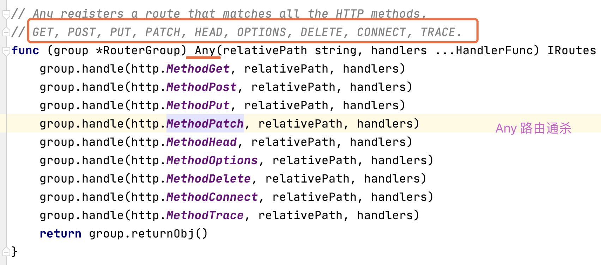

```go
Beego框架学习与使用

http://book.qingwakong.com/fyouku/2.1.html
```

#### 第一章 基础入门

##### 1.1  Go语言

为什么使用Go?

语法简洁，语言优势。

- 静态类型，编译型语言
- 原生支持http服务
- 原生支持并发编程
- 对微服务有较好支持
- 支持长链接


Go官网链接

~~~go
https://golang.google.cn
~~~


Go下载安装

~~~go
https://golang.google.cn/dl
~~~


Mac环境搭建Go

- GOROOT 就是Go的安装环境
- GOPATH 就是工作目录，包含 src、pkg、bin文件夹
- 注意：不要把gopath设置成安装目录

~~~go
# mkdir /usr/local/go
# cd /usr/local/go

//1、下载
# wget https://golang.google.cn/dl/go1.15.2.darwin-amd64.tar.gz

//2、解压
# tar -zxvf go1.15.2.darwin-amd64.tar.gz

//3、配置
# vim ~/.bash-profile
export GOROOT=/usr/local/go
export GOPATH=/Users/chenglh/GoRoot
export PATH=/usr/local/go/bin:$GOPATH/bin:$PATH

//4、生效
source ~/.bash_profile
~~~


检测Go是否安装成功

~~~go
go version
~~~


##### 1.2 框架介绍

###### 1.2.1 安装与升级

Beego 简单化：RESTful 支持、MVC 模型；内置了强大的模块，包括 Session、缓存操作、日志记录、配置解析、性能监控、上下文操作、ORM 模块、请求模拟等强大的模块；支持高并发等。


框架地址：

~~~go
https://beego.me
~~~


Beego安装

~~~go
//Beego安装是典型的go安装包安装，命令行
go get github.com/astaxie/beego
~~~

Bee工具安装

~~~go
//bee 工具是一个为了协助快速开发beego项目而创建的项目
go get github.com/beego/bee
~~~

安装ORM

~~~GO
go get github.com/astaxie/beego/orm
~~~


Bee可执行文件默认存放在$GOPATH/bin里面，所以需要把$GOPATH/bin配置到环境变量。

~~~go
//在IDE命令行下
$ bee version
~~~


Bee命令

~~~go
bee new 创建一个新的beego项目

bee api	只是用于api，不会创建static和views目录

bee run	运行beego项目

bee pack 打包编译生成文件，注意 mac下打包到linux 使用命令：bee pack -be GOOS=linux
~~~

1、创建项目：

~~~go
//bee new fyouku  //前端
bee api fyoukuApi //接口
~~~

2、初始化项目模块

~~~go
go mod init fyoukuApi
~~~

3、将依赖包复制到项目下的vendor目录

~~~go
go mod vendor
~~~

4、运行项目

~~~go
bee run
~~~


Beego升级

1、命令行方式升级(推荐)

~~~go
go get -u github.com/astaxie/beego
~~~

2、或者源码下载升级，用户下载 https://github.com/astaxie/beego，然后覆盖到$GOPATH/src/github.com/astaxie/beego目录，然后执行命令

~~~go
go install github.com/astaxie/beego
~~~


###### 1.2.2 beego路由

路由设置两种方式：

~~~go
//方法一：vi /routers/router.go
beego.Router("/hello", &controllers.UserController{}, "get:GetHello")
//然后UsersController中
/**
func (u *UserController) GetHello() {
	var (
		title string
	)
	title = "hello golang"
	u.Ctx.WriteString(title)
}*/

//方法二：touch /controllers/demo.go
/** 1、创建控制器
2、引入beego，定义DemoController结构体
3、定义方法，方法上面打上注解
//@router /channel/list:key [get]
4、在路由文件中引入控制器的路由
beego.Include(&controllers.DemoController{})
~~~

~~~go
//一、【自定义控制器】
package controllers

import (
	"github.com/astaxie/beego"
)

type DemoController struct {
	beego.Controller
}

//输出Hello World
// @router /demo/hello [get]
func (this *DemoController) GetHello() {
	var title = "hello world!"
	this.Ctx.WriteString(title)
}

//2、【配置路由】
beego.Include(&controllers.DemoController{})
~~~


访问方式：

~~~html
http://localhost:8080/hello
http://localhost:8080/demo/hello
~~~


1.2.3 数据库ORM

修改配置文件：

~~~go
#mysql配置
driverName = mysql
mysqluser = root
mysqlpwd = 12345678
host = 127.0.0.1
port = 3306
dbname = fyouku
~~~


创建models/model.go文件

~~~go
package models

import (
	"fmt"
	"github.com/astaxie/beego"
	"github.com/astaxie/beego/orm"
	_ "github.com/go-sql-driver/mysql" //引入数据库驱动
)

func init() {
	driverName := beego.AppConfig.String("driverName")

	//注册数据库驱动
	orm.RegisterDriver(driverName, orm.DRMySQL)

	//连接数据库
	user := beego.AppConfig.String("mysqluser")
	pwd := beego.AppConfig.String("mysqlpwd")
	host := beego.AppConfig.String("host")
	port := beego.AppConfig.String("port")
	dbname := beego.AppConfig.String("dbname")

	//dbConn := "root:password@tcp(127.0.0.1:3306)/dbname?charset=utf8"
	dbConn := user + ":" + pwd + "@tcp(" + host + ":" + port + ")/" + dbname + "?charset=utf8"

	//连接数据库
	err := orm.RegisterDataBase("default", driverName, dbConn)
	if err != nil {
		fmt.Println("连接数据库出错")
		return
	}
	fmt.Println("连接数据库成功")
}
~~~


###### 1.2.4 改造登录接口

修改配置文件 config/app.conf

~~~go
md5code = RaW#xhH2aVgo!Iy1  //自定义加密串
~~~


php的路由

~~~php
//登录接口
Route::post('login/do', 'UserController/loginDo');
//注册接口
Route::post('register/save', 'UserController/saveRegister');
~~~


注册页面

~~~go
// vi controllers/user.go
package controllers

import (
	"github.com/astaxie/beego"
)

type UserController struct {
	beego.Controller
}

//注册页面
// @router /register [get]
func (this *UserController) Register() {
	this.TplName = "register.html"
}


~~~


公共函数

~~~go
// $ vi controllers/common.go
package controllers

import (
	"github.com/astaxie/beego"
	"regexp"
)

type CommonController struct {
	beego.Controller
}

type JsonStruct struct {
	Code  int         `json:"code"`
	Msg   interface{} `json:"msg"`
	Items interface{} `json:"items"`
	Count int64       `json:"count"`
}

//成功返回值
func ReturnSuccess(code int, msg interface{}, items interface{}, count int64) (json *JsonStruct) {
	json = &JsonStruct{Code: code, Msg: msg, Items: items, Count: count}
	return
}

//失败返回值
func ReturnError(code int, msg interface{}) (json *JsonStruct) {
	json = &JsonStruct{Code: code, Msg: msg}
	return
}
~~~


https://www.bilibili.com/video/BV1cg4y1B7Ev?p=5

http://www.coder55.com/article/25952

https://blog.csdn.net/qq_36431213/article/details/82982181


==**Gin框架**==

安装框架

~~~go
go get -u github.com/gin-gonic/gin
~~~


==main.go文件入口==

~~~go
$ vi main.go

package main

import "github.com/gin-gonic/gin"

func main() {
	router := gin.Default()

	router.GET("/", func(ctx *gin.Context) {
		ctx.String(200, "hello gin~")
	})

	router.Run()
}
~~~


==飘红处理==

~~~go
go mod init www.gin.com    //初始化模块

go mod vendor  //下载模块到本地
~~~


==源码分析==

~~~go
package main

import "github.com/gin-gonic/gin"

func main() {
	router := gin.Default() //区别：1、比gin.New多了两个默认中间件（日志，恢复），2、打印的信息也些少区别；Default() 还是会执行 New()操作
	//router := gin.New()
    //default是new的升级版

	router.GET("/", func(ctx *gin.Context) {
		ctx.String(200, "hello gin~")
	})

	router.Run()
	//router.Run(":9000") //指定端口
}
~~~


==路由方法==




==抽离逻辑==

~~~go
package main

import "github.com/gin-gonic/gin"

func Hello(ctx *gin.Context) {
	ctx.String(200, "hello gin~")
}

func main() {
	router := gin.Default()

    router.GET("/", Hello)  //不需要写() 会报错

	router.Run()
}
~~~


###### 第一节 使用模板

==1、有几级目录，得在通配符上指明==

~~~go
一级：router.LoadHTMLGlob("template/*")   //基本很少使用一级
二级：router.LoadHTMLGlob("template/**/*")
三级：router.LoadHTMLGlob("template/**/**/*")
~~~


==2、指定html文件==

~~~go
ctx.HTML(200, "index/index.html", nil)
ctx.HTML(200, "user/index.html", nil)
~~~

==3、在html中==

~~~go
{{ define "user/index.html" }}

html内容块

{{ end }}
~~~


例子

~~~go
func main() {
	router := gin.Default()

	router.LoadHTMLGlob("template/**/*")

	router.GET("/", Hello)

	router.Run()
}

func Hello(ctx *gin.Context) {
	ctx.HTML(200, "index/index.html", nil)
}
~~~


~~~html
{{ define "index/index.html" }}
<!DOCTYPE html>
<html lang="en">
<head>
    <meta charset="UTF-8">
    <title>Title</title>
</head>
<body>
{{.name}} - {{.age}}
</body>
</html>
{{ end }}
~~~


==静态资源目录==

~~~go
//静态资源
router.Static("/static", "static")
~~~


则在 html中  直接使用如：/static 其实不是一个文件夹，是uri的。只是与static目录名称一致

~~~php
/static/css/index.css
/static/images/default.jpg
/static/js/jquery.js
~~~


