~~~php
##【狂神说Java】ElasticSearch7.6.x最新完整教程通俗易懂
https://www.bilibili.com/video/BV17a4y1x7zq?from=search&seid=12015532356934620698
~~~

##### 第一章 Elasticsearch简介

###### 1.1 什么是Elasticsearch？

Elasticsearch，简称es，是一个开源的==**高扩展**==的==**分布式全文检索引擎**==，近乎实时的存储、检索数据；

Elasticsearch是一个基于Lucene的搜索服务器。它提供了一个分布式多用户能力的全文搜索引擎，基于RESTful web接口。

==全文检索，高亮，搜索推荐...==

###### 1.2 Elasticsearch使用案例

1、2013年初，GitHub采取Elasticsearch来做PB级搜索，20T的数据，包括13亿文件和1300亿行代码
2、==维基百科==，启动以Elasticsearch为基础的核心搜索架构
3、SoundCloud 提供即时而精准的==音乐搜索服务==
4、百度广泛使用Elasticsearch作为==文本数据分析==
5、新浪使得ES分片处理32亿条==实时日志==
6、阿里使用ES构建==挖掘日志采集和分析体系==

##### 第二章 Elasticsearch安装

###### 2.1 Elasticsearch安装

> 下载安装，注意，mac需要下载 darwin的包，如果下载linux的包，java环境变量有问题

~~~php
https://www.elastic.co

官网下载好慢

可以使用华为镜象下载
ElasticSearch: https://mirrors.huaweicloud.com/elasticsearch/?C=N&O=D

//等一下下面要使用的
//logstash: https://mirrors.huaweicloud.com/logstash/?C=N&O=D
//kibana: https://mirrors.huaweicloud.com/kibana/?C=N&O=D

$ wget https://mirrors.huaweicloud.com/elasticsearch/7.9.3/elasticsearch-7.9.3-darwin-x86_64.tar.gz
~~~

> 解压：

~~~php
$ java  -version

$ tar -zxvf elasticsearch-7.9.3-darwin-x86_64.tar.gz
~~~

> 启动：

~~~php
$ cd elasticsearch-7.9.3

$ ./bin/elasticsearch
~~~

启动后检查是否成功：打开浏览器 http://127.0.0.1:9200

> ==目录介绍==

~~~php
bin 	启动文件
config	配置目录
	log4j2	日志配置文件
	jvm.options		java虚拟机相关配置（如果内存不够，如修改：-Xms1g   -Xmx1g 如 -Xms256m  -Xmx256m 即1G修改成256m）
	elasticsearch.yml	端口、网关、跨域等
lib		相关java架包
modules	功能模块
plugins	插件
~~~

###### 2.2 Elasticsearch-head安装

> 安装可视化界面  header插件，依赖nodejs

github地址：

~~~php
https://github.com/mobz/elasticsearch-head
~~~

> **先安装nodejs环境**

~~~php
$ brew install node

$ node -v
$ npm -v
~~~

这里是直接下载的 

~~~php
$ wget wget https://github.com/mobz/elasticsearch-head/archive/master.zip

$ mv master.zip elasticsearch-head.zip

// 解压：
$ tar -zxvf elasticsearch-head.zip

$ cd elasticsearch-head
~~~

命令行  $  cat package.json  查看需要关联到的依赖

~~~php
"devDependencies": {
    "grunt": "1.0.1",
    "grunt-contrib-concat": "1.0.1",
    "grunt-contrib-watch": "1.0.0",
    "grunt-contrib-connect": "1.0.2",
    "grunt-contrib-copy": "1.0.0",
    "grunt-contrib-clean": "1.0.0",
    "grunt-contrib-jasmine": "1.0.3",
    "karma": "1.3.0",
    "grunt-karma": "2.0.0",
    "http-proxy": "1.16.x"
 }
~~~

> 1、安装  elasticsearch-head

~~~php
$ cd elasticsearch-head

$ npm  install
~~~

如果报错，可以根据提示信息进行更新操作。

如果再以下错误，修改镜向

> 2、启动 elasticsearch-head

~~~php
$ npm run start
~~~

**具体界面展示：**

> 3、==浏览器查看：==这里是访问不到的，端口或域名、IP不一样都会==产生跨域问题==, 可以F12查看网络连接结果

==官方具体的操作步骤：==

> 4、解决跨域问题

~~~php
// 修改 elasticsearch中的config配置
$ vi config/elasticsearch.yml 

http.cors.enabled: true
http.cors.allow-origin: "*"    //注意，这里冒号后是有个空格的
~~~

> 5、重启 elasticsearch

==刷新浏览器链接==

> ==Elasticsearch-head的界面接口不好用，建议使用来当展示数据工具==

###### 2.3 Kibana安装

> 了解ELK

ELK是==Elasticsearch、Logstash、 Kibana==三大开源框架首字母大写简称。市面上也被成为Elastic Stack，其中Elasticsearch是一个基于Lucene、分布式、通过Restful方式进行交互的近实时搜索平台框架。像类似百度、谷歌这种大数据全文搜索弓|擎的场景都可以使用Elasticsearch作为底层支持框架，可见Elasticsearch提供的搜索能力确实强大,市面上很多时候我们简称Elasticsearch为es，Logstash是ELK的中央数据流引擎，用于从不同目标(文件/数据存储/MQ )收集的不同格式数据,经过过滤后支持输出到不同目的地(文件/MQ/redis/elasticsearch/kafka等)。

Kibana可以将elasticsearch的数据通过友好的页面展示出来,提供实时分析的功能。

==收集清洗数据 -> 搜索，存储 -> Kibana==

市面上很多开发只要提到ELK能够一致说出它是一个日志分析架构技术栈总称 ,但实际上ELK不仅仅适用于日志分析,它还可以支持
其它任何数据分析和收集的场景，日志分析和收集只是更具有代表性。并非唯一性。

> 安装 Kibana

Kibana是一个针对Elasticsearch的开源分析及可视化平台,用来搜索、查看交互存储在Elasticsearch索引中的数据。使用Kibana ，
可以通过各种图表进行高级数据分析及展示。Kibana让海量数据更容 易理解。它操作简单,基于浏览器的用户界面可以快速创建仪
表板( dashboard )实时显示Elasticsearch查询动态。设置Kibana非常简单。无需编码或者额外的基础架构,几分钟内就可以完成
Kibana安装并启动Elasticsearch索引监测。
官网: https://www.elastic.co/cn/kibana

==Kibana版本要与Elasticsearch版本一致。==

Kibana是一个标准工程，ELK特点是开箱即用。

==1、下载与解压：==

~~~php
$ wget https://artifacts.elastic.co/downloads/kibana/kibana-7.9.3-darwin-x86_64.tar.gz

$ tar -zxvf kibana-7.9.3-darwin-x86_64.tar.gz
~~~

==2、启动==

~~~php
$ cd kibana-7.9.3-darwin-x86_64

$ ./bin/kibana
~~~

命令行提示：

==3、通过浏览器查看==

http://localhost:5601

==4、开发者工具==

==5、汉化==

~~~php
$ cd kibana-7.9.3-darwin-x86_64/x-pack/plugins/translations/translations
$ ls -l
ja-JP.json	zh-CN.json

$ vi kibana-7.9.3-darwin-x86_64/config/kibana.yml
#默认是英文
#i18n.locale: "en"
i18n.locale: "zh-CN"
~~~

==6、重启kibana==

刷新浏览器 http://localhost:5601

###### 2.4 Elasticsearch使用

==集群、节点、索引、类型、文档、分片、映射是什么？==

> elasticsearch是面向文档，一切都是json

与关系型数据库对比

elasticsearch(集群)中可以包含多个索引数据库) ,每个索|中可以包含多个类型(表) ,每个类型下又包含多个文档(行),每个文档中又包含多个字段(列)。
==物理设计：==
elasticsearch在后台把每个**索引划分成多个分片**，每分分片可以在集群中的不同服务器间迁移

==逻辑设计：==
一个索引类型中，包含多个文档，比如说文档1 , 文档2。当我们索引一篇文档时，可以通过这样的一各顺序找到它：索引 》类型
》文档ID ，通过这个组合我们就能索引到某个具体的文档。 注意:ID不必是整数,实际上它是个字符串。

> 文档就是一条记录

> 类型  就是字段存入的数据类型

> 索引 就相当于数据库

索引是一个非常大的文档集合，索引存储了映射类型的字段和其他设置。然后它们被存储到各个分片上。

**物理设计：节点和分片如何工作**

一个集群至少有一个节点，而一个节点就是一个elasticsearch进程，如果创建了索引将有有5个分片(primary shard，又称主分片)构成的，每个主分片会有一个副本(replica shard，又称复制分片)。

上图是一一个有3个节点的集群,可以看到主分片和对应的复制分片都不会在同一一个节点内,这样有利于某个节点挂掉了,数据也不至于失。实际上, ==一个分片是一个Lucene索引，一个包含倒排索引的文件目录，倒排索引的结构使得elasticsearch在不扫描全部文档的情况下==,就能告诉你哪些文档包含特定的关键字。

一个节点挂了，另两个节点的数据也不至于丢失。

> 倒排索引

elasticsearch使用的是一种称为==倒排索引==的结构，==**采用Lucene倒排索作为底层**==。这种结构适用于快速的==全文搜索==，一个索引由文
档中所有不重复的列表构成，对于每一个词 ，都有一个包含它的文档列表。例如,现在有两个文档，每个文档包含如下内容:

~~~php
Study every day， good good up to forever  #文档1包含的内容
To forever, study every day， good good up #文档2包含的内容
~~~

为了创建倒排索引，我们首先要将每个文档拆分成独立的词(或称为词条或者tokens) ，然后创建一个包含所有不重复的词条的排序
列表，然后列出每个词条出现在哪个文档：

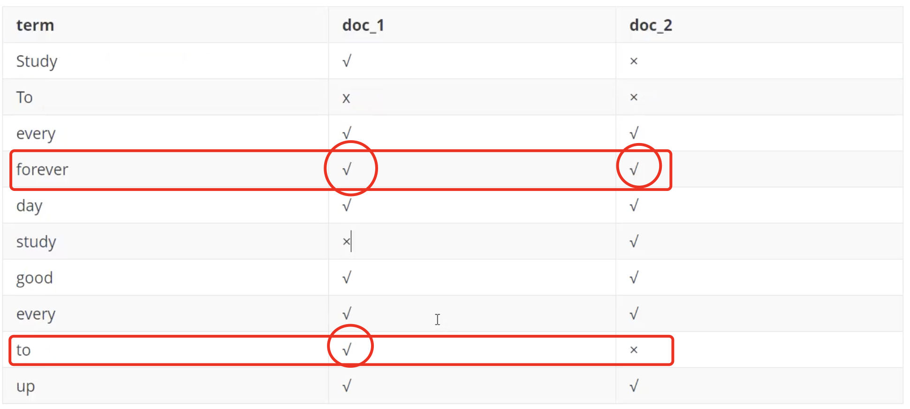

文档1的权重更高。权重在这里叫分数 score

搜索linux 完全过滤掉 python的记录，这样是提高了搜索效率。

**ES核心概念**

1、索引

2、字段类型(mapping)

3、文档(documents)

4、分片(倒序排序)

###### 2.5 IK分词器插件

> 什么是IK分词器？

通过字典来拆分句子；

IK提供两个分词算法：ik_smart 和 ik_max_word， 其中 ik_smart 为最少切分； ik_max_word为最细粒度划分。

==**这个分词器也要下载与Elasticsearch相对应的版本，否则Elasticsearch启动不起来**==

==1、下载安装==

~~~php
https://github.com/medcl/elasticsearch-analysis-ik

wget https://github.com/medcl/elasticsearch-analysis-ik/archive/master.zip

mv master.zip elasticsearch-analysis-ik.zip
~~~

==2、下载完毕后，放入到我们的elasticsearch插件即可==

~~~php
$ cp elasticsearch-analysis-ik.zip ./elasticsearch-7.9.3/plugins

$ cd ./elasticsearch-7.9.3/plugins

// 解压包
$ tar -zxvf elasticsearch-analysis-ik-master.zip
$ mv elasticsearch-analysis-ik-master ik
~~~

==3、重启 ES==

方法一：细节观察

方法二：命令行模式

~~~php
./bin/elasticsearch-plugin list
~~~

==4、使用kibana测试==

http://localhost:5601/app/dev_tools#/console

ik_smart 和 ik_max_word， 其中 ik_smart 为最少切分； ik_max_word为最细粒度划分。

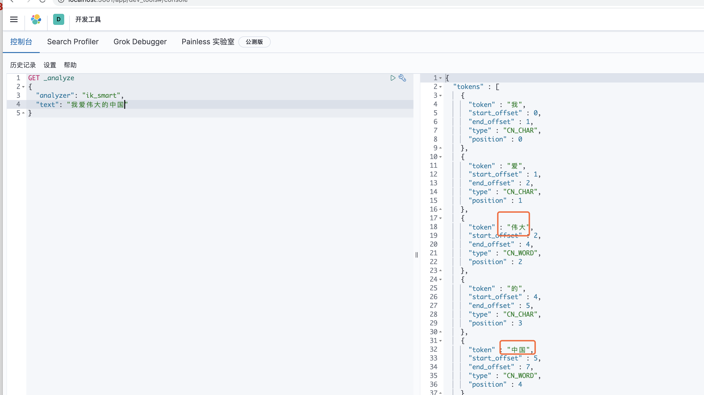

现在问题来了，==有些新词汇没有在字典中罗列：名字被拆开了==

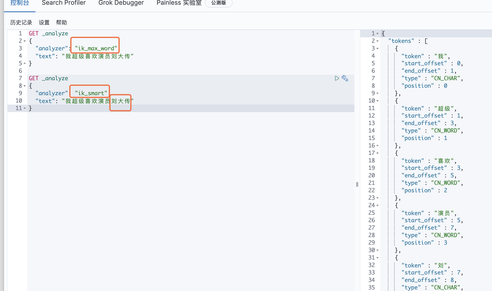

==5、自定义字典==

**1、定义词典，如：my_test.dic；**

**2、修改配置文件；**

**3、重启ES**

~~~php
$ cd /elasticsearch-7.9.3/plugins/ik/config

$ cat IKAnalyzer.cfg.xml
=======================================
<?xml version="1.0" encoding="UTF-8"?>
<!DOCTYPE properties SYSTEM "http://java.sun.com/dtd/properties.dtd">
<properties>
	<comment>IK Analyzer 扩展配置</comment>
	<!--用户可以在这里配置自己的扩展字典 -->
	<entry key="ext_dict"></entry>
	 <!--用户可以在这里配置自己的扩展停止词字典-->
	<entry key="ext_stopwords"></entry>
	<!--用户可以在这里配置远程扩展字典 -->
	<!-- <entry key="remote_ext_dict">words_location</entry> -->
	<!--用户可以在这里配置远程扩展停止词字典-->
	<!-- <entry key="remote_ext_stopwords">words_location</entry> -->
</properties>

// 可以扩展字典，如下：
<!--用户可以在这里配置自己的扩展字典 -->
	<entry key="ext_dict">my_test.dic</entry>

//
~~~

重启后的结果：

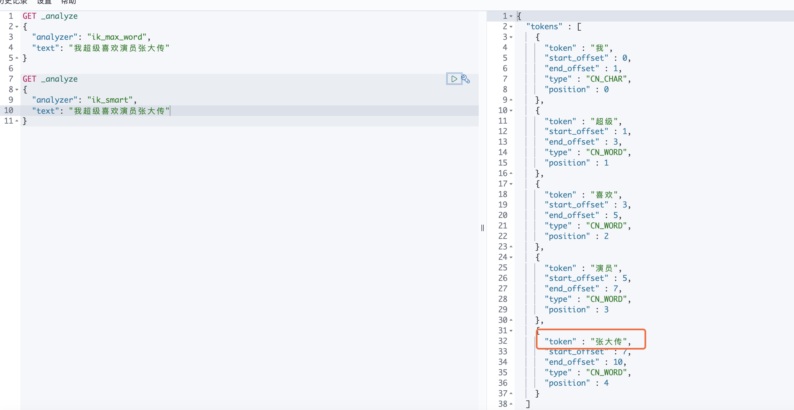

###### 2.6 基本操作

一种软件架构风格，而不是标准，只是提供了一组设计原则和约束条件。它主要用于客户端和服务器交互类的软件。基于这个风格
设计的软件可以更简洁,更有层次,更易于实现缓存等机制。

基本Rest命令说明:

> 基本操作

==1、创建索引==

~~~php
PUT /索引名/~类型名~/文档id
{请求体}
~~~

查看结果：

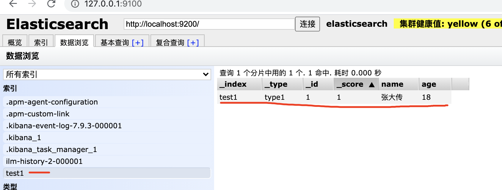

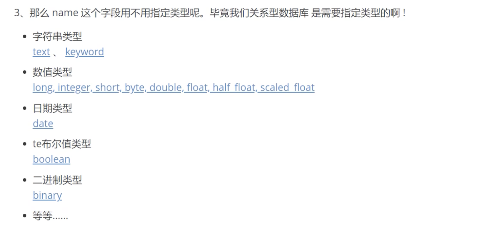

==4、指定字段的类型==

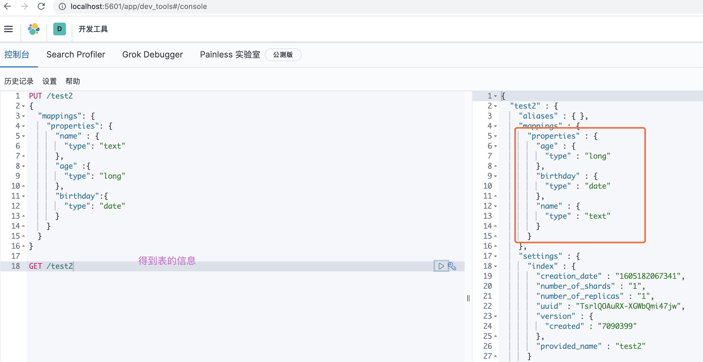

==5、查看默认信息==

\_doc 是不需要指定类型，\_type会在8.0之后弃用。

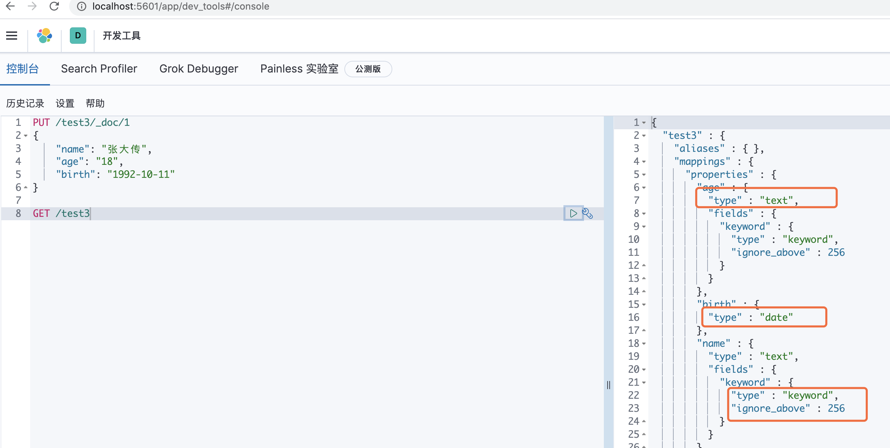

如果自己的文档字段没有指定，那么 es 就会给我们默认配置字段类型！

扩展：通过命令 elasticsearch 索引情况。

GET _cat 可以查看很多信息

获取 elasticsearch 健康状态

> 修改

方法一：旧方法，==有个缺点，如果有字段漏了，原来的会被删除==

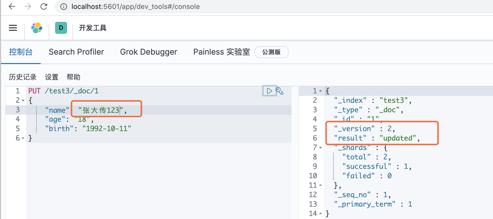

方法二：

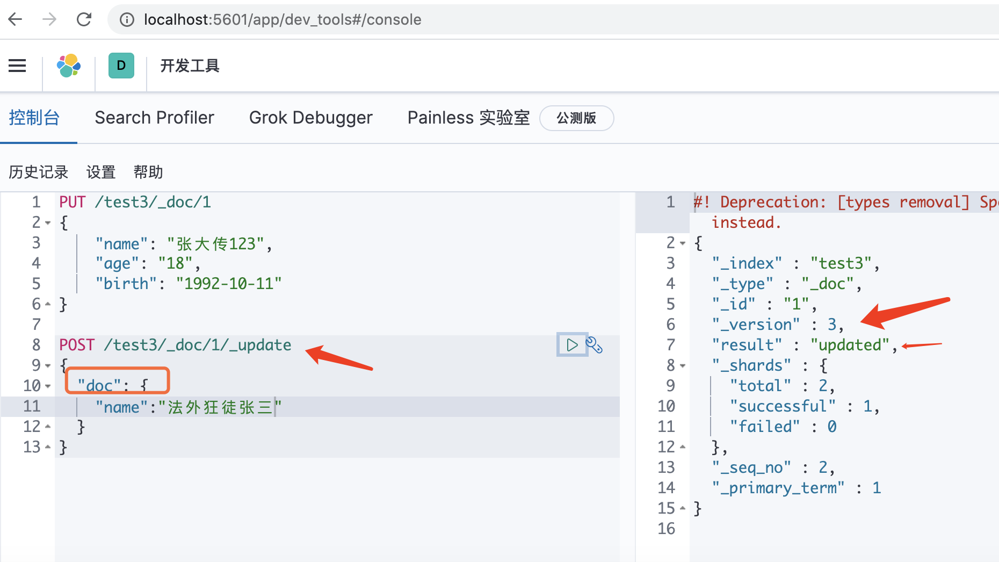

> 删除索引

通过 DELETE 命令实现

删除索引还是文档记录

**基本操作**

==1、添加数据==

~~~bash
PUT /chenglh/user/1
{
  "name" : "李小明",
  "age" : 3,
  "desc" :"宅得不要不要的",
  "tags":["吃饭","旅游","游戏"]
}
~~~

==2、获取数据==

==3、更新数据==

==4、POST  _update记录== 推荐使用

~~~bash
POST /chenglh/user/1/_update
{
  "doc":{
    "name" : "李小明二二三"
  }
}

// 注意：必须要加上 _update，否则与 PUT没有区别，会把其他没有填写的字段全部置空。
~~~

==5、简单搜索== (都是使用GET)

~~~bash
GET /chenglh/user/1
~~~

简单条件查询：

~~~bash
GET /chenglh/user/_search?q=name:明二
~~~

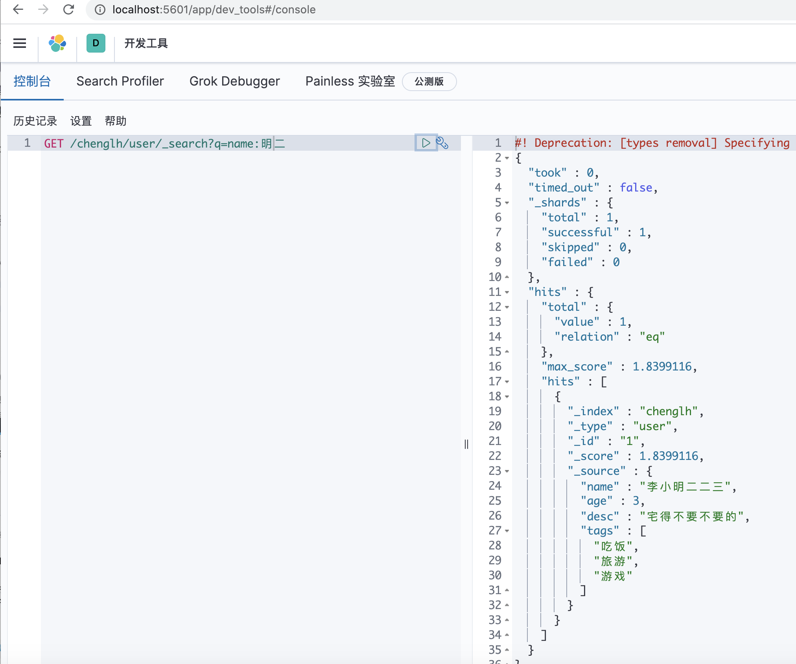

> ==复杂搜索== select (排序、分布、高亮、模糊查询、精准查询！)

再添加一条数据：

~~~bash
PUT /chenglh/user/4
{
  "name" : "张三峰",
  "age" : 3,
  "desc" :"不知道是谁",
  "tags":["吃饭","旅游","跳舞"]
}
~~~

==查询结果==

~~~bash
GET /chenglh/user/_search
{
  "query":{
    "match": {
      "name": "张三"
    }
  }
}
~~~

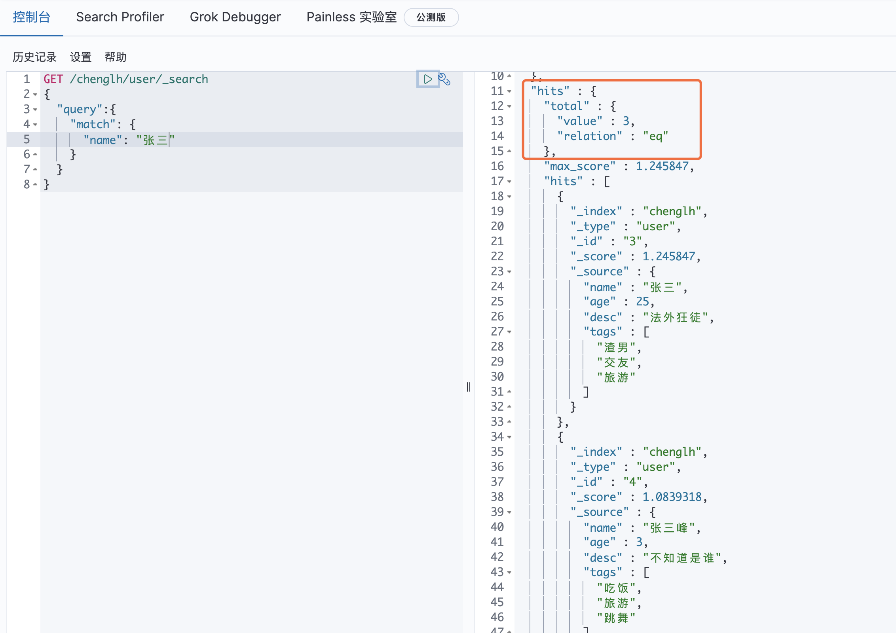

==结果的过滤==

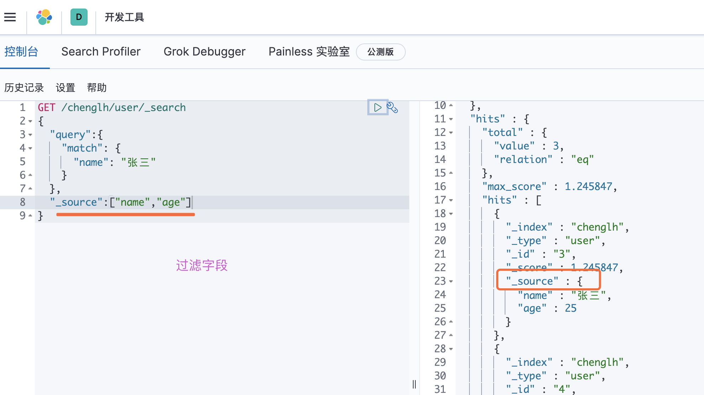

==排序查询==

~~~bash
GET /chenglh/user/_search
{
  "query":{
    "match": {
      "name": "张三"
    }
  },
  "sort":[
    {
      "age" : {
        "order" : "desc"
      }
    }
  ]
}
~~~

得到的结果：（==有固定的排序后，分值就没有了 变成 null==）

==分页显示==

~~~bash
GET /chenglh/user/_search
{
  "query":{
    "match": {
      "name": "张三"
    }
  },
  "sort":[
    {
      "age" : {
        "order" : "desc"
      }
    }
  ],
  "from":0,   //从第几个数据开始
  "size":2    //返回多少条数据
}
~~~

==多条件查询==

Must (对应 and 所有条件都要满足)

~~~bash
GET /chenglh/user/_search
{
  "query":{
    "bool": {
      "must": [
        {
          "match": {
            "name": "张三"
          }
        },
        {
           "match": {
              "age": "25"
            }
        }
      ]
    }
  }
}
~~~

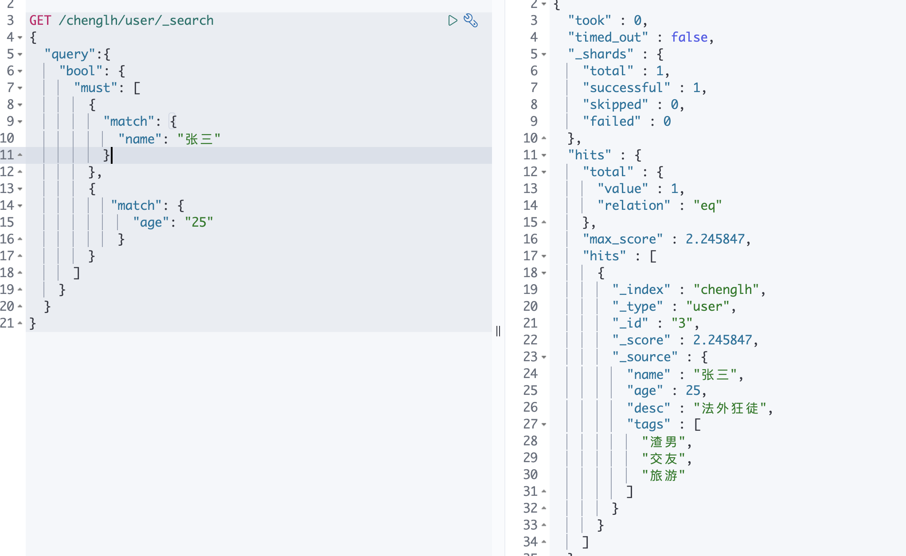

Should ( 相当于 or ) ，或者的关系，符合其中一个即可

~~~bash
GET /chenglh/user/_search
{
  "query":{
    "bool": {
      "should": [
        {
          "match": {
            "name": "张三"
          }
        },
        {
           "match": {
              "age": "25"
            }
        }
      ]
    }
  }
}
~~~

不等于 must_not 

~~~bash
GET /chenglh/user/_search
{
  "query":{
    "bool": {
      "must_not": [
        {
           "match": {
              "age": "25"
            }
        }
      ]
    }
  }
}
~~~

增加过滤条件：

~~~bash
GET /chenglh/user/_search
{
  "query":{
    "bool": {
      "must": [
        {
           "match": {
              "name": "张三"
            }
        }
      ],
      "filter":{
        "range" : {
         "age" : {
             "gt" : 10
          }
         }
       }
    }
  }
}
~~~

- gt 大于
- gte 大于等于
- Lt 小于
- Lte 小于等于

大于等于 && 小于等于

~~~
GET /chenglh/user/_search
{
  "query":{
    "bool": {
      "must": [
        {
           "match": {
              "name": "张三"
            }
        }
      ],
      "filter":{
        "range" : {
         "age" : {
             "gte" : 10，
			 "lte" : 25
          }
         }
       }
    }
  }
}
~~~

多条件 ，结果中也是会有分值的 【多个条件使用空格隔开，只要满足其中一个结果既可以被查出，晕个时候可以通过分值基本的判断】

~~~bash
GET /chenglh/user/_search
{
  "query":{
    "match": {
      "tags": "男 吃饭"
    }
  }
}
~~~

> 精确查询

Term 查询是直接通过倒排索引指定的词条进行精确的查找的！

trem ,直接查询精确的

Match 会使用分词器解析！(先分析文档，然后在通过分析的文档进行查询)

**两个类型 keyword  text**

