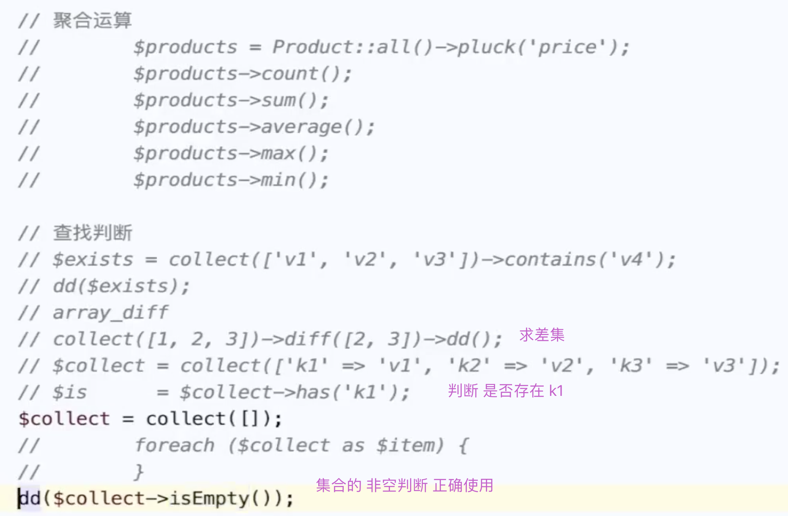
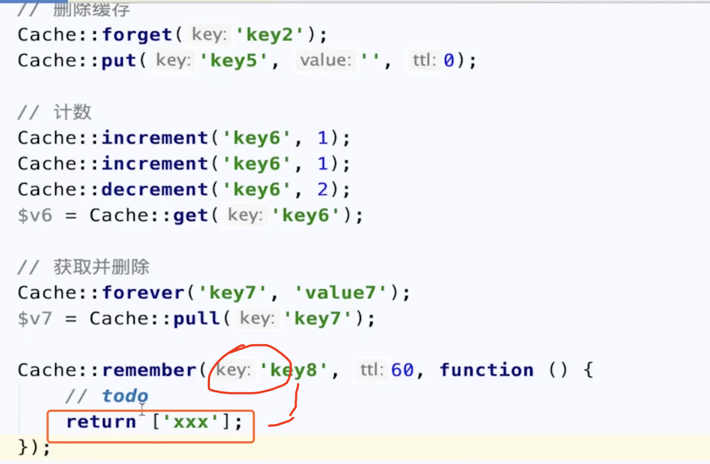
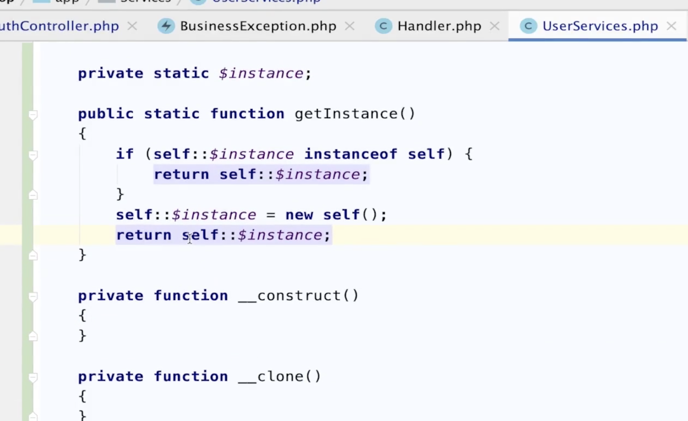
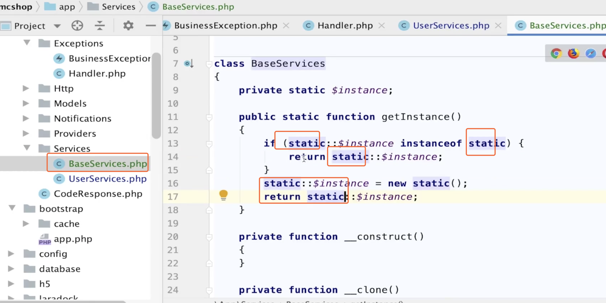

==Laravel入门到放弃==


~~~php
composer -h

查找composer安装路径

php -d memory_limit=-1 /usr/local/bin/composer install
~~~


文档路径

~~~php
https://learnku.com/docs/laravel/5.7/releases/2239
~~~


##### 1.1 框架入门

~~~php
composer create-project --prefer-dist laravel/laravel dev.laravel.com "5.7.*"
~~~


默认是要带index.php访问

~~~php
Nginx重写：

location / {
    try_files $uri $uri/ /index.php?$query_string;
}
~~~


**Laravel框架基础**


文档参考：

~~~php
https://learnku.com/docs/laravel/5.7/releases/2239
~~~


###### 1.1.1 目录结构

~~~php
app					程序应用目录
    Console			命令行相关目录
    	Kernel.php	命令行内核
    Exceptions		自定义的异常处理类
    	Handler.php	集中处理异常类
    Http
    	Controllers	控制器相关目录
    	Middleware	中间件
    	Kernel.php	Http的内核
    Providers		服务提供者目录，是在程序初始化加载时做的一些事情
    Models			模型目录(手动创建的)
bootstrap		引导启动目录
	cache		框架生成的缓存，如路由缓存、服务缓存等
    app.php     加载框架内核
config			框架所有的配置文件，数组形式返回
database		数据库迁移文件
    factories	数据模型生成类
    migrations	数据表的结构生成和修改
	seeds		数据填充
public			程序的入口
    index.php
resources		程序资源文件
    js
    lang		语言包
    	en
    sass
    views
routes				路由目录
    api.php			api接口路由
    channels.php	广播路由
  	console.php		命令行的路由
    web.php			页面路由
storage				存储目录，目录包含了编译后的 Blade 模板、基于文件的 Session、文件缓存，以及其它由框架生成的文件
    app				app生成的一些文件
    framework		用于存放框架生成的文件和缓存
    logs			应用的日志文件
tests				测试目录
    Feature			功能测试（整个功能的测试）
    Unit			单元测试（某个函数的测试）
vendor				所有的外部依赖类库
.env
artisan
composer.json
composer.lock
server.php
~~~


###### 1.1.2 路由

**URL结构**

~~~php
https://sitechecker.pro/knowledge-base/?name=article&topic=seo#top

https:// 				//协议 protocol
sitechecker.pro			//域名 domain
knowledge-base			//访问路径 path (转发的路由)
?name=article&topic=seo	//请求参数
#top					//锚点
~~~


**laravel相关命令行**

~~~php
php artisan					//查看所有命令信息

php artisan | grep route	//管道符过滤搜索信息

php artisan route:cache		//把路由缓存起来
php artisan route:clear		//清除路由缓存
php artisan route:list		//查看所有的路由
~~~


==查看路由列表==


==常用路由==

~~~php
Route::get('/user', 'UserController@index'); //从服务器取出资源列表

Route::get('/user/ID', 'UserController@detail'); //从服务器取出ID的资源

Route::post('/user', 'UserController@add'); //在服务器新建一个资源

Route::put('/user/ID', 'UserController@update'); //在服务器更新资源(完整更新)

Route::patch('/user/ID', 'UserController@update'); //在服务器更新资源(修改属性，即部分)

Route::delete('/user/ID', 'UserController@delete'); //删除操作

Route::options($uri, $callback);//获取信息
~~~


==多种方式请求==

~~~php
Route::match(['get', 'post'], 'UserController@update');
~~~


==路由重定向==

~~~php
//301 - 永久重定向（seo收录重写向后的地址）

//302 - 临时重定向 (seo收录之前的)
~~~


==举例如下：==

~~~php
Route::get('/here', function (){
    return '重定向前';
});
Route::get('/there', function (){
    return '重定向后';
});

//301 - 永久重定向
//Route::permanentRedirect('here', 'there');

//302 - 临时重定向
Route::redirect('here', 'there');
~~~


重定向传参数

1、使用query方式，即如在uri后面  http://www.test.cn/here?id=1200&price=10.2&name=水杯

在目标地址函数中注入 Request $request对象，使用 $input = $request->query();


2、使用post方式，使用 $input = $request->post();方式获取。


3、uri方式传参数，如：http://www.test.cn/here/1200

~~~php
实现如下路由功能：如果不传id=1200，默认是查询所有列表。

Route::get('/user/{id}', 'UserController@detail'); //这里必须要传参数

//Route::get('/user/{id}/{name}', 'UserController@detail');  传递多个参数

Route::get('/user/{id?}', 'UserController@detail'); //这里可以不传参数，但是定义方法中参数必须要默认值
~~~


举例如下：

~~~php
//路由

Route::any('/order',"OrderController@index");

++++++++++++++++++++++++++++++++++++++++++++++++++++++

<?php
namespace App\Http\Controllers;

use Illuminate\Http\Request; //【注意这里引入的相关http类】

class OrderController extends Controller
{
    public function index(Request $request)
    {
        $query = $request->query();  //get方式的传参数
        $post  = $request->post();	 //post方式的传参数
        
        return [$query, $post];
    }
}
~~~


**==注意：路由重复定义，只有第一个才生效，其他的不生效==**


==路由参数约束==

~~~php
Route::get('/order/{id}/{name}', 'OrderController@detail')
    ->where('id', '[0-9]+')
    ->where('name', '[a-zA-Z]+');
~~~


路由全局参数约束(相对少用)

~~~php
# vi ./app/Providers/RouteServiceProvider.php

public function boot()
{
    // 在 boot的函数里添加
    //parent::pattern('id', '[0-9]+');
    parent::patterns(['id'=>'[0-9]+', 'name'=>'[a-zA-Z]+']);
    parent::boot();
}
~~~


==路由别名==

~~~php
Route::get('getUser', 'UserController@getUser')->name('user.getUser');
Route::get('getUrl', function (){
//    return redirect()->route('user.getUser'); //路径跳转
//    return redirect()->to(route('user.getUser'));
    return \route('user.getUser', [], false); //返回路由相对路径
});
~~~


路由分组与加载

~~~php
如增加 admin.php 后台入口

// 第一步：
# vim ./routes/admin.php
//添加路由规则

// 第二步：
# vim app/Providers/RouteServiceProvider.php

// 这里的 ServiceProvider是别名，RouteServiceProvider路由服务提供者，点进去后
// public function boot()里有加载或刷新路由表，$this->app['router']加载到服务容器中
use Illuminate\Foundation\Support\Providers\RouteServiceProvider as ServiceProvider;

class RouteServiceProvider extends ServiceProvider
{
    ......
    public function map()
    {
        $this->mapApiRoutes();  //API的路由

        $this->mapWebRoutes();  //web的路由

        //$this->mapAdminRoutes();
    }

    protected function mapAdminRoutes()
    {
        Route::prefix('admin')
            ->middleware('admin')
            ->namespace($this->namespace)
            ->group(base_path('routes/admin.php'));
    }
~~~


###### 1.1.3 中间件

**平时报的 419 错误码，一般是中间件拦截了的**

在接口使用时，可以先注释掉csrf的校验。在laravel5.7的版本中

~~~php
# vim app/Http/Kernel.php

//\App\Http\Middleware\VerifyCsrfToken::class, 注释掉
~~~


其他更高级的laravel版本则在中间件中 app/Http/Middleare/VerifyCsrfToken.php中注释掉。


==中间件创建==

~~~php
php artisan make:middleware Benchmark   //用户记录程序运行时间的中间件
~~~


在 handle方法中写逻辑方法

~~~php
<?php

namespace App\Http\Middleware;

use Closure;
use Illuminate\Support\Facades\Log;

class Benchmark
{
    public function handle($request, Closure $next)
    {
        //return $next($request); //$next相当于要执行的业务逻辑程序
        
        //前置
        $startTime = microtime(true);
        
        $response  = $next($request);//业务逻辑
        
        //后置
        $runTime = microtime(true) - $startTime;
        Log::info('benchmark', [
            'url' => $request->url(),
            'input' => $request->input(),
            'time' => "$runTime ms"
        ]);

        return $response;
    }
}
~~~


==中间件的使用==，把中间件注册到框架中

**1、全局中间件**

**2、路由中间件**

**3、控制器中使用**


==1、全局中间件== ，在内核内中添加 app/Http/Kernel.php

~~~php
//全局中间件
protected $middleware = [
    \App\Http\Middleware\CheckForMaintenanceMode::class,
    \Illuminate\Foundation\Http\Middleware\ValidatePostSize::class,
    \App\Http\Middleware\TrimStrings::class,
    \Illuminate\Foundation\Http\Middleware\ConvertEmptyStringsToNull::class,
    \App\Http\Middleware\TrustProxies::class,
    Benchmark::class,   //这里写入中间件类
    //'benchmark'
];

//分组路由中间件
protected $middlewareGroups = [
    'web' => [
        ......
        //'benchmark'
    ],

    'api' => [
        ......
    ],
];

//定义中间件别名
protected $routeMiddleware = [
    ......
    //'benchmark' => \App\Http\Middleware\Benchmark::class,
];

//这里是路由权重顺序，越在前面的就越重，先执行
protected $middlewarePriority = [
    \Illuminate\Session\Middleware\StartSession::class,
    \Illuminate\View\Middleware\ShareErrorsFromSession::class,
    \App\Http\Middleware\Authenticate::class,
    \Illuminate\Session\Middleware\AuthenticateSession::class,
    \Illuminate\Routing\Middleware\SubstituteBindings::class,
    \Illuminate\Auth\Middleware\Authorize::class,
];
~~~


==测试观察中间件==

~~~php
# tail -f storage/logs/laravel.log
~~~


==2、路由中间件==  (只挂载在当前路由中生效)

~~~php
Route::get('/test',"UserController@test")->middleware(App\Http\Middleware\Benchmark::class);
//Route::get('/test',"UserController@test")->middleware('benchmark'); 别名写法
~~~


挂载到路由分组中

~~~php
protected $middlewareGroups = [
    'web' => [
        //......
        Benchmark::class,
    ],

    'api' => [
        //......
    ],
];
~~~


==路由别名==  ( app/Http/Kernel.php)

~~~php
protected $routeMiddleware = [
    'auth' => \App\Http\Middleware\Authenticate::class,
    ......
    'benchmark' => \App\Http\Middleware\Benchmark::class,
    //定义好别名之后，上面的两处注释就可以简写了
];
~~~


3、中间件还可以通过==控制器构造函数来生效==

==这里的好处是可以，使用黑白名单过滤方法名，也可以传递参数==

~~~php
use App\Http\Middleware\Benchmark;
class UserController extends Controller
{
    public function __construct()
    {
        //点进去程序 middleware里定义了两个属性
        $this->middleware("benchmark",
            //['exptet' => ['index', 'test']] //这是黑名单，即排除掉
            ['only'=>['index']] //这是白名单，即生效方法
        );
        //$this->middleware(Benchmark::class);
    }

    public function index(Request $request)
    {
        $query = $request->query();
        $input = $request->input();

        return ['query'=>$query, 'input'=>$input];
    }
}
~~~


中间件传参

~~~php
use App\Http\Middleware\Benchmark;
class UserController extends Controller
{
    public function __construct()
    {
        $this->middleware("benchmark:liming,boy");//这里传递两个参数
    }

    public function index(Request $request)
    {
    }
}

中间件中接收参数
class Benchmark
{
    public function handle($request, Closure $next, $name, $sex)
    {
    }
}
~~~


==中间件指定顺序执行==，app/Kernel.php指定顺序

~~~php
protected $middlewarePriority = [
    //中间件名称1
	//.....
];
~~~


==laravel系统自带的中间件==说明

~~~php
protected $middleware = [
    \App\Http\Middleware\CheckForMaintenanceMode::class,//检测 laravel 是否处于维护状态
    \Illuminate\Foundation\Http\Middleware\ValidatePostSize::class,//ValidatePostSize检验上传数据的大小
    \App\Http\Middleware\TrimStrings::class,//传入参数头尾的空格
    \Illuminate\Foundation\Http\Middleware\ConvertEmptyStringsToNull::class,//把空串传为null
    \App\Http\Middleware\TrustProxies::class, //服务器与客户端中间有一层代理服务器，信任代理中间件
];

protected $middlewareGroups = [
    'web' => [
        //cookie
        \App\Http\Middleware\EncryptCookies::class,//cookie加解密
        \Illuminate\Cookie\Middleware\AddQueuedCookiesToResponse::class,//cookie添加到response
        
        //session
        \Illuminate\Session\Middleware\StartSession::class,//开启session
        // \Illuminate\Session\Middleware\AuthenticateSession::class,
        \Illuminate\View\Middleware\ShareErrorsFromSession::class,
        
        //csrf攻击
        //\App\Http\Middleware\VerifyCsrfToken::class, web访问的可以开启，api的就不需要了
        \Illuminate\Routing\Middleware\SubstituteBindings::class,//参数的绑定如: /{id} 可以传成 ?id=12
    ],

    'api' => [
        'throttle:60,1', // throttle别名，可以用来限流的，这里是1分钟限定访问60次，对应文件中有具体类路径
        'bindings',
    ],
];

protected $routeMiddleware = [
    //鉴权
    'auth' => \App\Http\Middleware\Authenticate::class,
    'auth.basic' => \Illuminate\Auth\Middleware\AuthenticateWithBasicAuth::class,
    
	//绑定参数
    'bindings' => \Illuminate\Routing\Middleware\SubstituteBindings::class,
    'cache.headers' => \Illuminate\Http\Middleware\SetCacheHeaders::class,//缓存头
    
    //鉴权
    'can' => \Illuminate\Auth\Middleware\Authorize::class,
    'guest' => \App\Http\Middleware\RedirectIfAuthenticated::class,
    
    //认证
    'signed' => \Illuminate\Routing\Middleware\ValidateSignature::class,//验签
    'throttle' => \Illuminate\Routing\Middleware\ThrottleRequests::class,//限流
    'verified' => \Illuminate\Auth\Middleware\EnsureEmailIsVerified::class,//系统验证邮件地址

    //自定义中间件
];
~~~


###### 1.1.4 数据库配置

数据库参数配置，在 .env文件中

~~~php
DB_CONNECTION=mysql
DB_HOST=127.0.0.1
DB_PORT=3306
DB_DATABASE=testdb
DB_USERNAME=root
DB_PASSWORD=123456
~~~


==单一数据库配置==

~~~php
# vim app/database.php
<?php
//这里的值对应的是下面的 真正连接资源名字
'default' => env('DB_CONNECTION', 'mysql'),

'connections' => [
	//这个名称对应的 上面default 的具体名字
    'mysql' => [
        'driver' => 'mysql',
        'host' => env('DB_HOST', '127.0.0.1'),
        'port' => env('DB_PORT', '3306'),
        'database' => env('DB_DATABASE', 'forge'),
        'username' => env('DB_USERNAME', 'forge'),
        'password' => env('DB_PASSWORD', ''),
        'unix_socket' => env('DB_SOCKET', ''),
		'charset' => 'utf8mb4',
        'collation' => 'utf8mb4_unicode_ci',
        'prefix' => '',
        'prefix_indexes' => true,//是否要使用前缀，如果设为false，上面的一行配置就失效了
        'strict' => true, //mysql严格格式
        //如int在严格模式下 "1"写不进去，长度60字段写入100字节，严格下不可以写成功，但是在非严格模式下会截断写成功
        'engine' => null,
    ],
....
~~~


==主从复制配置==

~~~php
'mysql' => [
    'driver' => 'mysql',
    'read' => [
        ['host' => '127.0.0.1', 'username'=>'root', 'password'=>'12345678', /*'database'=>'testdb1'*/],
        ['host' => '127.0.0.1', 'username'=>'root', 'password'=>'12345678', /*'database'=>'testdb2'*/],
    ],
    'write' => [
        ['host' => '127.0.0.1', 'username'=>'root', 'password'=>'12345678', /*'database'=>'testdb'*/],
    ],
    'port' => env('DB_PORT', '3306'),
    'database' => env('DB_DATABASE', 'testdb')
    'unix_socket' => env('DB_SOCKET', ''),
    'charset' => 'utf8mb4',
    'collation' => 'utf8mb4_unicode_ci',
    'prefix' => '',
    'prefix_indexes' => true,
    'strict' => true,
    'engine' => null,
],
~~~


实现原理：

~~~php
1、根据 database.php 配置，创建写库和读库的链接 connection
2、调用 select 时先判断使用读库还是写库，而 insert/update/delete 统一使用写库
~~~


**1、判断 database.php 是否配置了读写分离数据库**

~~~php
//文件位置：Illuminate/Database/Connectors/ConnectionFactory.php

public function make(array $config, $name = null)
{
    $config = $this->parseConfig($config, $name);

    //如果配置了read读库，则同时创建读链接和写链接
    if (isset($config['read'])) {
        return $this->createReadWriteConnection($config);
    }
	//否则创建单个链接资源
    return $this->createSingleConnection($config);
}
~~~


**2、创建读库和写库的链接**

~~~php
protected function createReadWriteConnection(array $config)
{
    //获取写库的配置信息，并创建链接
    $connection = $this->createSingleConnection($this->getWriteConfig($config));
	//获取读库配置信息，创建读库链接
    return $connection->setReadPdo($this->createReadPdo($config));
}
~~~


**3、多个读库或者写库会选择哪个**

~~~php
protected function getReadWriteConfig(array $config, $type)
{
    //如果数组 读/写有多个库，则随机获取一个，否则默认
    return isset($config[$type][0]) ? Arr::random($config[$type]) : $config[$type];
}
~~~


**4、select和insert/update/delete源码解析**

~~~php
文件位置：Illuminate/Database/Connection.php
~~~


==(1) select 函数根据第三个输入参数判断使用读库还是写库==

~~~php
public function select($query, $bindings = [], $useReadPdo = true)
{
    return $this->run($query, $bindings, function ($query, $bindings) use ($useReadPdo) {
        if ($this->pretending()) {
            return [];
        }

        // 根据 第三个参数 $useReadPdo 来确定使用读库还是写库，true为读库，为默认库；false为写库。
        $statement = $this->prepared($this->getPdoForSelect($useReadPdo)
                                     ->prepare($query));

        $this->bindValues($statement, $this->prepareBindings($bindings));

        $statement->execute();

        return $statement->fetchAll();
    });
}
~~~


==(2) insert/update/delete 统一使用写库==

~~~php
public function insert($query, $bindings = [])
{
    return $this->statement($query, $bindings);
}

public function update($query, $bindings = [])
{
    return $this->affectingStatement($query, $bindings);
}

public function delete($query, $bindings = [])
{
    return $this->affectingStatement($query, $bindings);
}


public function statement($query, $bindings = [])
{
    return $this->run($query, $bindings, function ($query, $bindings) {
        //....
        $statement = $this->getPdo()->prepare($query);
        return $statement->execute();
        //....
    });
}

public function affectingStatement($query, $bindings = [])
{
    return $this->run($query, $bindings, function ($query, $bindings) {
        //......
        $statement = $this->getPdo()->prepare($query);
        $statement->execute();
		//......
    });
}
~~~


**总结：**

~~~php
1，getReadPdo() 获得读库链接，getPdo() 获得写库链接。

2，select() 函数根据第三个参数判断使用读库还是写库。
~~~


**==强制从写库读取数据的方法==**

~~~php
use App\Models\Goods;
use Illuminate\Support\Facades\DB;
use Illuminate\Database\Connectors\ConnectionFactory;

//方法一：
return Goods::query()->lock()->find(2);

//方法二：
return Goods::onWriteConnection()->whereIn('id',[1,2])->get(['*']);

//方法三：
$sql = 'select * from item_goods';
return DB::select($sql, [], false);  //第三个参数设置成 false

//方法四：
$sql = 'select * from item_goods';
return DB::selectFromWriteConnection($sql);
~~~


###### 1.1.5 数据库迁移


==先安装 migrate数据表==（第一次执行迁移文件时需要操作以下命令，主要是创建migrate表）

~~~php
php artisan migrate:install
~~~


数据库迁移前置知识

~~~php
//指定路径生成 表迁移文件
$ php artisan make:migration create_hx_orders_table --path=app/Custom/Guestbook/database/migrations

//执行路径下的 表迁移文件
$ php artisan migrate  --path=app/Custom/Guestbook/database/migrations
~~~


**==1、创建数据表==**

~~~php
$ php artisan make:migration create_hx_orders_table 

$ php artisan make:migration create_hx_orders_item_table

//以上分别生成 hx_orders 及 hx_orders_item表，如果需要指定其他的表名，可以使用 --create=表名
// php artisan make:migration create_hx_orders_table --create=orders  即生成orders表名
~~~


脚本生成迁移 hx_orders 数据表

~~~php
#  vim 2021_02_19_140748_create_hx_orders_table.php

<?php
use Illuminate\Support\Facades\DB;
use Illuminate\Support\Facades\Schema;
use Illuminate\Database\Schema\Blueprint;
use Illuminate\Database\Migrations\Migration;

class CreateHxOrdersTable extends Migration
{
    public function up()
    {
        Schema::create('hx_orders', function (Blueprint $table) {
            $table->increments('order_id')->comment('ID主键');//默认就是主键
            $table->unsignedInteger('user_id')->default(0)->comment('用户ID');
            $table->string('user_nickname', 120)->default('')->comment('用户昵称');
            $table->string('order_sn', 60)->nullable(false)->unique('order_sn')->comment('订单编号');
            $table->decimal('total_amount', 10, 2)->default('0.00')->comment("订单金额");
            $table->decimal('final_amount',10,2)->default('0.00')->comment('实付金额');
            $table->tinyInteger('payment_type')->default(1)->comment('支付方式，1支付宝;2微信');
            $table->dateTime('payment_time')->comment('支付时间');
            $table->string('ship_reciver_info', 500)->default('')->comment('收货信息');
            $table->text('description')->default(null)->comment('备注');
            $table->timestamps();

            //添加索引，索引可以在上面字段中直接添加，指定索引名称，默认的字段是表名+字段名+index 过长
            //$table->unique('order_sn', 'order_sn');
            $table->index('created_at', 'created_at');

            //表引擎
            $table->engine = 'innodb';
        });

        DB::statement("ALTER TABLE `hx_orders` comment '订单表'");
    }

    public function down()
    {
        Schema::dropIfExists('hx_orders');
    }
}
~~~


**==2、修改数据表==**

~~~php
# composer require doctrine/dbal    修改表结果需要，安装此插件
~~~


~~~php
//如果报内存不够的错误信息，如需要查看composer的安装路径
# composer -h
# php -d memory_limit=-1 /usr/local/bin/composer require  doctrine/dbal
~~~


举例说明：==增加列字段==

~~~php
# php artisan make:migration add_quantity_to_hx_orders_table --path=app/Custom/Guestbook/database/migrations

public function up()
{
    Schema::table('hx_orders', function (Blueprint $table) {
        $table->integer('quantity')->default(0)->after('order_sn')->comment('商品数量');
    });
}

public function down()
{
    Schema::table('hx_orders', function (Blueprint $table) {
        $table->dropColumn('quantity');
		//$table->dropColumn(['quantity']);//如果有多列的，可以放入数组
    });
}
~~~


举例说明：==删除列字段==

~~~php

~~~


举例说明：==修改列字段==

~~~php
# php artisan make:migration alter_quantity_hx_orders_table --path=app/Custom/Guestbook/database/migrations

public function up()
{
    //mysql命令行方式
    DB::statement("alter table hx_orders add prepay_rate2 decimal(6,4) 
    	DEFAULT '0' COMMENT '提前结清违约金费率2';");
}

public function down()
{
    DB::statement("alter table hx_orders DROP prepay_rate2;");
}
~~~


其实的例子：

~~~php
Schema::table('sys_sale_order', function (Blueprint $table) {
    //新增字段
    $table->string('ship_telephone', 15)->default('')->after('payment_time')->comment('手机号码');

    //修改字段
    $table->string('name', 50)->change();//修改长度或类型都可以

    //列重命名
    $table->renameColumn('oldName', 'newName');

    //删除单列或多列
    $table->dropColumn('votes');
    //$table->dropColumn(['votes', 'avatar', 'location']);

    //删除索引
    $table->dropIndex(['state']);//单列或多列
});
~~~


**执行数据库迁移操作**

~~~php
#默认路径
php artisan migrate

#指定路径
//php artisan migrate  --path=app/Custom/Guestbook/database/migrations
~~~


**回滚上一批次的操作**

~~~php
//默认路径
php artisan migrate:rollback

#指定路径
//php artisan migrate:rollback  --path=app/Custom/Guestbook/database/migrations
~~~


**数据库迁移总结**

~~~php
//创建
php artisan make:migration create_hx_orders_table --path=app/...

//增加
php artisan make:migration add_quantity_to_hx_orders_table --path=app/...

//修改
php artisan make:migration alter_tablename_table

//删除

//执行
php artisan migrate

//回滚
php artisan migrate:rollback
~~~


==**在使用时需注意：有些字段数据结构是不能通过数据库迁移修改得了的**==

如：**bigInteger、binary、boolean ......等等**

也如：枚举也是不能修改的。


###### 1.1.6 数据模型

创建模型：

~~~php
<?php
namespace App\Models;

use Illuminate\Database\Eloquent\Model;

class Goods extends Model
{
    //默认数据库表名
    protected $table = "sdb_b2c_goods";

    //哪个连接驱动
    protected $connection = "mysql";

    //数据库主键
    protected $primaryKey = "id";

    //不主动修改 created_at 和 updated_at字段
    public $timestamps = false;

    protected $guarded = [];
}
~~~


使用模型：

~~~php
public function detail()
{
    //return Goods::query()->find(2);

    $goods = new Goods();
    $goods->fill([
        'name' => 'test-write-name',
        'title' => 'test-write-title',
        'create_time' => time(),
        'status' => 1,
        'created_at' => date('Y-m-d H:i:s'),
        'updated_at' => date('Y-m-d H:i:s'),
    ]);
    $goods->save();
    return $goods;
}
~~~


###### 1.1.7 服务层

为了不使用控制器过重，加多了一个层

~~~php
<?php
...
class UserServices
{
	public function getByUserName($username)
    {
		return User::query()->where('username',$username)->where('deleted',0)->first();
    }

	public function getByUserMobile($mobile)
    {
		return User::query()->where('mobile',$mobile)->where('deleted',0)->first();
    }
}
~~~


###### 1.1.8 时间操作

==laravel自带了时间处理库==

~~~php

// 获取当前时间和时间戳
echo Carbon::now(); //获取得到是的 Y-m-d H:i:s格式
echo Carbon::now()->timestamp;

//获取昨天、今天、明天时间
echo Carbon::today();     // Y-m-d 00:00:00
echo Carbon::tomorrow();
echo Carbon::yesterday();

//获取几天前或几天后
echo Carbon::now()->addDay(-2)->toDateString();

//日期类型转换为字符串
echo Carbon::now()->toDateString();         // 2021-02-21

echo Carbon::now()->toDateTimeString();     // 2021-02-21 09:41:42

echo Carbon::now()->toTimeString();         // 09:43:42

//动态计算时间时要注意下
$startTime = Carbon::now();
$endTime = $startTime->copy()->addDay(5);
//或者 $endTime = Carbon::now()->addDay(5);
echo $startTime,'--',$endTime;
~~~


门面模式验证：

~~~php
<?php
$validator = Validator::make( ['mobile' => $mobile], [ " mobile' => 'regex:/~1[0-9][10]$']) ;
if ($validator->fails()) [
	return ['errno' => 704, I'errmsg' => ' P8E;Et'];l
]
~~~


~~~php
header中添加：Accept:application/json

$this->validate($request, [
    'goods_id' => 'required|integer',
    'num' => 'required|integer',
],[
    'goods_id.required' => 'goods_id必须',
    'num.required' => 'num必须',
    'num.integer' => 'num必须是数值',
]);

或者使用
$request->validate([
    'username' => 'required|string',
    'password' => 'required|string',
    'captcha' => ['required', 'captcha'],
], [
    'captcha.required' => '验证码不能为空',
    'captcha.captcha' => '请输入正确的验证码',
]);
~~~


代码提示：

~~~php
composer require --dev barryvdh/laravel-ide-helper
~~~


~~~php
php artisan ide-helper:models

> no   //让其生成到一个新的文件中

~~~


~~~php
public function getCoupon($id, $columns = ['*'] )
	return Coupon:: query()->whereDeleted( value: Ø)->whereId($id) ;
    return Coupon::query()->where( 'deleted', Ø)->find($id, $co lumns) ;
	//可以有提示提示，需要去掉 static
}
~~~


~~~php
php artisan ide-helper: generate - PHPDoc generation for L .aravel Facades //解决门面模式下的方法
php artisan ide-helper:models - PHPDocs for models
php artisan ide-helper:meta - PhpStorm Meta file      //ide重启才能生效，解决通过工厂模式找对应的方法和属性
~~~


软删除的代码块

表字段名  deleted deleted_at

~~~php
class Goods extends BaseModel
{
    use  SoftDeletes;

    protected $casts =[
        ‘counter_price' => 'float',
        'retail_ price' => 'float',
        'is_new'=>'boolean',
        'is_hot'=>'boolean',
        'gallery' => 'array' ,
        'is_on_ ale' =>'boolean'
    ];
}
~~~


生成密钥

~~~php
php artisan key:generate
~~~


~~~php
//创建监听器
# php artisan make:listener DBSqllistener

<?php
namespace App\Listeners;

use Illuminate\Database\Events\QueryExecuted;
use Illuminate\Queue\InteractsWithQueue;
use Illuminate\Contracts\Queue\ShouldQueue;
use Illuminate\Support\Facades\Log;

class DBSqllistener
{
    /**
     * Create the event listener.
     *
     * @return void
     */
    public function __construct()
    {
        //
    }

    /**
     * Handle the event.
     *
     * @param  object  $event
     * @return void
     */
    public function handle(QueryExecuted $event)
    {
		if (! app()->environment(['dev', 'local', 'production'])) {
			return;
		}

        $sql = $event->sql;
        $bindings = $event->bindings;
        $time = sprintf("%s s", $event->time/1000);

        $bindings = array_map(function ($binding) {
            if (is_string($binding)) {
                return "'$binding'";
            } else {
                if ($binding instanceof \DateTime) {
                    return $binding->format("'Y-m-d H:i:s'");
                }
                return $binding;
            }
        }, $bindings);

        $sql = str_replace('?', '%s', $sql);
        $sql = sprintf($sql, ...$bindings);
        Log::info('sql', ['sql语句'=>$sql, '执行时间'=>$time]);

        return;
    }
}
~~~


###### ==1.2 创建控制器==

自动加载好相关继承基类

~~~php
php artisan make:controller UserController
~~~


模型创建，指定目录下

~~~php
php artisan make:model Models/Menu
~~~

常见操作，指定表名，主键和禁用时间戳

~~~php
namespace App\Models;

use Illuminate\Database\Eloquent\Model;

class Menu extends Model
{
    protected $table = "menu";
    
    protected $primaryKey = "menu_id";
    
    public $timestamps = false;
}
~~~


==方法一：传递参数(get、post)==

~~~php
路由

Route::any("/user", "UserController@index");

控制器

public function index(Request $request)
{
    $query = $request->query();
    $input = $request->input();

    return ['query'=>$query, 'input'=>$input];
}
~~~


==方法二：路径传参==

~~~php
Route::post("/user/{id?}", "UserController@index");

//如果加了 ？ 表示可以不传参数，但是控制器中必须要给默认值。

public function index(Request $request, int $id = 0)
{
    $query = $request->query();// get方式传值
    $input = $request->input();// get或post传值

    return ['query'=>$query, 'id'=>$id ,'input'=>$input];
}
~~~


路由需要保持唯一，否则只有第一个才生效。

~~~php
路由支持正则
Route::get("/test/{id?}/{name?}", "UserController@test")
    ->where('id', "[0-9]+")
    ->where('name', "[a-zA-Z]+");

public function test(int $id=0, string $name = '')
{
    return [$id, $name];
}
~~~


~~~php
规范
$ php artisan make:migration add_score_to_sys_sale_order_table --table=sys_sale_order //增加字段
移除  remove_score_to_sys....
修改  modify_ 或 update_....


$  php artisan make:migration modify_sys_sale_order_table --table=sys_sale_order
//需要指定表

public function up()
{
    //修改表备注
    DB::statement("ALTER TABLE `sys_sale_order` comment '订单主表'");
}
~~~


数据库操作：


~~~php
//select * from users where id > 1 and (email like '%@163' or name like '明%')

//有括号的 就使用闭包的方式把条件写出来

//引入的类
//use Illuminate\Database\Query\Builder;
echo DB::table('users')->where("id", ">", 1)->where(function(Builder $query){
    $query->where('email', 'like', '%@163')
        ->orWhere('name', 'like', '明%');
})->toSql();
~~~


插入记录/批量插入


更新操作


自增/减

删除


事务

开启方式1：闭包方式，自动提交和回滚，不需要人为控制

~~~php
//参数1，闭包函数，参数2：重试次数
~~~


==模型==


软删的字段 默认名称是 deleted_at


模型

~~~php
<?php

namespace App\Models;

use Illuminate\Database\Eloquent\Model;

class Menu extends Model
{
    //默认数据库表名
    protected $table = "hx_channel_menu";

    //哪个连接驱动
    protected $connection = "mysql";

    //数据库主键
    protected $primaryKey = "menu_id";

    //不主动修改 created_at 和 updated_at字段
    public $timestamps = false;

    //自定义的时间字段
    //const CREATED_AT = 'add_time';
    //const UPDATED_AT = 'update_time';

    protected $casts = [
        'url' => 'array'   //自动转换
    ];

    //白名单
//    protected $fillable = [
//        'title',
//        'pid',
//        'sort',
//        'url',
//        'hide',
//        'tip',
//        'group',
//        'icon'
//    ];

        //黑名单 不能与白名单同时出现
        protected $guarded = [];
}

~~~


模型使用

~~~php
$result = Menu::query()->create([
    'title'=>'test',
    'pid' =>0,
    'sort' => 0,
    'url'=> ['user_id'=>12, 'user_name'=>'李四'],
    'hide'=>0,
    'tip'=>'',
    'group'=>'',
    'icon'=>''
]);
var_dump($result);
~~~


软删除，创建表时必须有对应字段，模型中使用对应属性，以下表示 模型在使用时自动带上   `deleted_at` is null  user 表示使用代码块


软删除和恢复


==集合==


```php
//$collection = collect([1, 2, 3]);
//dd($collection->toArray());
//dd($collection->all());
// toArray与all功能一样

$collect = collect(['k1'=>'v1', 'k2'=>'v2', 'k3'=>'v3']);
$keys = $collect->keys()->toArray();//获取keys
$values = $collect->values()->toArray();//获取values


//dd($keys, $values);
//dd($collect->last());
//dd($collect->only(['k1', 'k2'])->toArray()); //只要k1 k2的key=>value

// $products = Product::all();
// $products->pluck('title'); 取一列
// $products->take(2); 取两条
// $products->toJson(); 转换成json
// $products->pluck('title')->implode(',');  // implode()函数

// 聚合运算

// 包含判断

contains
has

// 运算
    
// 集合的判断

// where函数

// 遍历
each
map
$products->keyBy('id')->toArray();  把id取出来做key值,超实用
$products->toArray(); //索引自增的数组

groupBy('cate_id') //分组

//过滤筛选
$products->filter(function($item){
    return $item->price > 10;
})
    
    
key与value互换，一维数组
$collect->flip()->toArray();

//反序
collect->reverse()->toArray();

//排序
collect($aa)->sortDesc();
collect($aa)->sort();

$products->sortByDesc('price');
可以传入闭包，使用相关运算得到一个值
$products->sortByDesc(function($item){
    return $item['price'] * 10;
});
```





~~~php
$users = User::all();
//        $newUsers = $users->each(function ($item) {
//            return ($item->newId = '编号:'.$item->id); //可以对集合进行添加元素或处理值，其他元素保留
//        });
//        dd($newUsers->toArray());

$newUsers = $users->map(function ($item) {
    return ($item->newId = '编号:'.$item->id); //map只返回处理后的对应列，其他元素舍弃
});
dd($newUsers->toArray());


dd($users->keyBy('id'));//把id列作为 key 返回,把指定列 作为key返回数组

dd($users->groupBy('role_id'))
~~~











~~~php
##Laravel6.x从入门到进阶，深入浅出
https://www.bilibili.com/video/BV1eg4y1q7r7?p=42

##基于PHP Laravel 框架的项目实战全程实录
https://www.bilibili.com/video/BV1kJ411i7RY?p=1
~~~


1.1 分布式锁

> 下载安装

~~~php
#下载安装Laravel
composer create-project --prefer-dist laravel/laravel blog

#安装predis
composer require predis/predis
~~~


> 分布式锁：使用Redis来做互拆锁

如服务器A、B、C三台，一般不建议把Redis部署到某一台服务器(如B)上，对于用户访问B时没有延迟，但对于A、C有延迟，会造成不公平。可以把Redis单独部署一台服务器，对于服务器A、B、C是公平获取锁的。


> laravel已经封装了-分布式锁

**配置**

~~~php
# vi .env
将缓存驱动 CACHE_DRIVER=file 修改成 CACHE_DRIVER=redis
~~~


**分布式锁**

~~~php
# /vendor/laravel/framework/src/Illuminate/Events/RedisLock.php

//当前路径下还有其他的锁，如MemcachedLock.php缓存锁等
class RedisLock extends Lock{  //继承锁类
    //....
}

#对应的缓存执行器：/vendor/laravel/framework/src/Illuminate/Events/RedisStore.php
public function lock($name, $seconds = 0, $owner = null) {
    return new RedisLock($this->connection(), $this->prefix.$name, $seconds, $owner);
}
~~~


**原理**

~~~php
setnx key value
exprie key 10s
    
Redis单线程
    事件的分配器
    命令执行器
~~~


**Laravel框架**

~~~php
//创建控制器
> php artisan make:controller RedisLockController

# vi routes/web.php 添加路由
Route::get('index', 'RedisLockController@index');
~~~


举个栗子：

~~~php
use Illuminate\Support\Facades\Cache;

class RedisCacheController extends Controller {
    public function index() {
        $block = Cache::lock('stock', 10); //(key,10s缓存)，返回是Redis Lock对象
        //$block 对象获取锁
        if ($block->get()) {
            //TODO执行业务逻辑
            $block->release(); //释放锁
            return '执行完成';
        }
    }
}
~~~


> 问题：会不会互删锁，如A服务请求会不会删除B服务请求的锁，A缓存锁时间到10s释放了，B服务请求进来，已经上锁，但是A服务器执行到  $block->release()，即把B的锁给删除了

~~~php
#laravel底层 /vendor/laravel/framework/src/Illuminate/Events/RedisLock.php
public function release() {
    $this->redis->eval(LuaScripts::releaseLock(), 1, $this->name, $this->owner);
}

//链接到对应的函数
public static function releaseLock()
{
    return <<<'LUA'
if redis.call("get",KEYS[1]) == ARGV[1] then
    return redis.call("del",KEYS[1])
else
    return 0
end
LUA;
}
/** 从而A服务器的锁，删除加到A对应的锁
 * 所以不会乱删除锁
 */
~~~


1.2 消息队列

> 秒杀、排队处理业务、应用解耦、流量削峰等

~~~php
#创建控制器
> php artisan make:controller TradeController

#创建任务类
> php artisan make:job Trade

<?php
//...
class TradeController extends Controller {
    public function trade() {
        //订单参数
        $data = [
            'order_id' => date('YmdHis').uniqid()
        ];
        
        $job = new Trade();
        $job->dispatch($job)->onQueue('trade'); //分发到队列，且命名为trade
        return '订单的方法';
    }    
}

/** 命令行生成文件原理 */
/**
 * 1.在 index.php 文件里
 * $app = require_once __DIR__.'/../bootstrap/app.php';
 *
 * 2.代码跟踪到 app.php 文件
 * $app->singleton(
 *    Illuminate\Contracts\Http\Kernel::class,   "走路由模式"
 *    App\Http\Kernel::class
 *	);
 * $app->singleton(
 *   Illuminate\Contracts\Console\Kernel::class,  "走命令行模式"
 *   App\Console\Kernel::class   //点进去看代码，去到第三步
 * );
 *
 * 3. App\Console\Kernel.php
 * use Illuminate\Foundation\Console\Kernel as ConsoleKernel; //再点进去第4步
 * class Kernel extends ConsoleKernel {...}
 * 
 * 4.拿到这个实例(容器)，进行操作
 * public function __construct(Application $app, Dispatcher $events){
 * 	   $this->app = $app;
 *     ......
 * }
 * 
 * 5.其实是来到 /vendor\laravel\framework\src\Illumiate\Foundation\Console\JobMakeCommand.php
 * protected $name = 'make:job';
 * return $this->option('sync')
 *                 ? __DIR__.'/stubs/job.stub'
 *                 : __DIR__.'/stubs/job-queued.stub';
 * 里边有对应的文件模板，即命令行调用模板生成指定文件
 */
~~~


> 修改配置

~~~php
# vi .env
QUEUE_CONNECTION=redis
~~~


> 队列任务

~~~php
#控制器
<?php
namespace App\Http\Controllers;

use App\Jobs\Trade;
use Illuminate\Http\Request;

class TradeController extends Controller
{
    public function index() {
        //订单参数
        $data = [
            'order_id' => date('YmdHis').uniqid()
        ];

        $job = new Trade($data);
        $job->dispatch($job)->onQueue('trade'); //分发到队列，且命名为trade
        return '订单的方法';
    }
}

#任务类
<?php
namespace App\Jobs;

use Illuminate\Bus\Queueable;
use Illuminate\Queue\SerializesModels;
use Illuminate\Queue\InteractsWithQueue;
use Illuminate\Contracts\Queue\ShouldQueue;
use Illuminate\Foundation\Bus\Dispatchable;

class Trade implements ShouldQueue
{
    use Dispatchable, InteractsWithQueue, Queueable, SerializesModels;

    /** 接收传递数据 */
    public $data;

    public function __construct($data) {
        $this->data = $data;
    }

    public function handle() {
        $rand = mt_rand(1, 2);
        if ($rand == 2) {
            sleep(3);//延迟3秒执行
            throw new \Exception('任务失败');
        }
        var_dump($rand, $this->data->data);
    }
}
~~~


> 定时任务调度

1. 修改数据库配置

~~~php
# vi .env
DB_CONNECTION=mysql
DB_HOST=127.0.0.1
DB_PORT=3306
DB_DATABASE=thinkphp
DB_USERNAME=root
DB_PASSWORD=123456
DB_PREFIX=tp_

# vi config/database.php
'prefix' => env('DB_PREFIX', ''),
~~~


2. 创建数据表

~~~mysql
CREATE TABLE `tp_goods` (
  `id` int(10) unsigned NOT NULL AUTO_INCREMENT,
  `counts` int(11) DEFAULT NULL,
  `goods_name` varchar(150) DEFAULT NULL,
  PRIMARY KEY (`id`)
) ENGINE=InnoDB DEFAULT CHARSET=utf8mb4;
~~~


3. 任务调度程序

~~~php
# vi app\Console\Kernel.php
protected function schedule(Schedule $schedule)
{
    //异步任务的处理 每一分钟
    $schedule->call(function (){
        $str = implode(array_merge(range('a','z'), range('A','Z'), range('0', '9')));
        $str = substr(str_shuffle($str), 0, 5);
        DB::table('Goods')->insert(['counts'=>4,'goods_name'=>$str]);
    })->everyMinute();
}
~~~


4. 调用方式

~~~php
# 一、终端命令行方式调用
> php artisan schedule:run

# 二、windows下的脚本
# vi task.bat
E:
CD E:\www\blog
php artisan schedule:run 1>> NUL 2>&1

# 三、Linux下调度

~~~


1.3 RBAC权限管理

https://www.bilibili.com/video/av329058585?p=3


工具选择


重构仿站

~~~php
https://github.com/linlinjava/litemall
~~~


docker下载

~~~php
https://hub.docker.com
~~~


镜向下载 ==阿里去镜向==

~~~php
https://developer.aliyun.com/mirror
~~~


选择容器


点进去，会看到对应下载连接

~~~php
http://mirrors.aliyun.com/docker-toolbox/?spm=a2c6h.13651104.0.0.22c675bflsNyef
~~~


使用国内镜向，下载速度会快点


登录阿里云

~~~php
https://account.aliyun.com/
~~~


详细路径或直接搜索即可

~~~php
https://cr.console.aliyun.com/cn-qingdao/instances/mirrors
~~~


粘贴重启docker


命令行终端

~~~php
docker --version
    
docker-compose --version
~~~


下载软件

~~~php
https://iterm2.com/downloads.html
~~~


主题设置

~~~php
参考页面
https://www.cnblogs.com/guopeng112/p/12549084.html

主题下载
https://iterm2colorschemes.com/
~~~


语言包


~~~
 //https://www.bilibili.com/video/BV1cZ4y1u7xM?p=14
~~~

